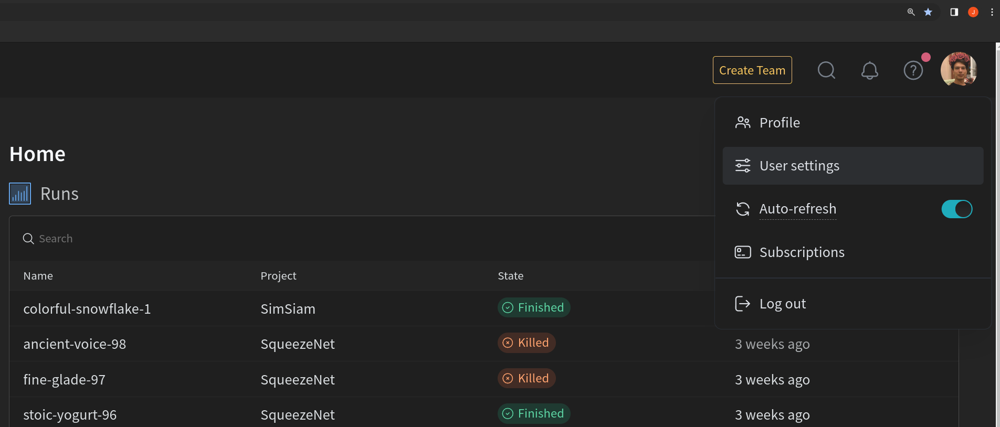
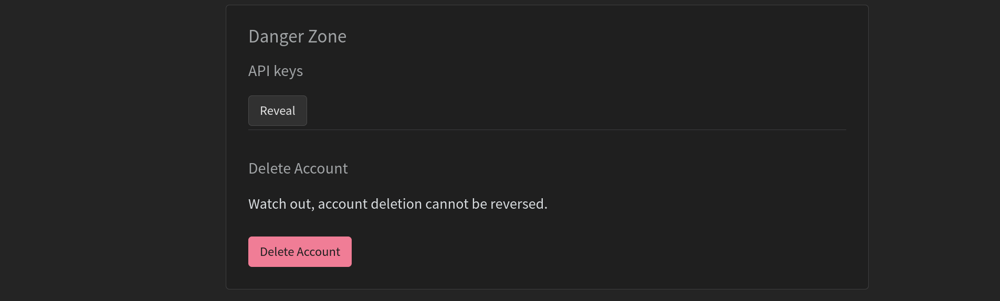

# Что это?

Тут лежит вариант решения домашки от лектора. В данной репе содержится реализация статьи [SimSiam](https://arxiv.org/abs/2011.10566) и несколько ноутбуков, один из которых производит решение последующей задачи классификации на данных, используемых при обучении самой SSL модели.

# Описание репозитория
- `notebooks` - тут валяются юпитер-тетрадки с подготовкой данных и решением последующей задачи классификации на данных, используемых при обучении SSL модели:
    - `notebooks/check_transforms.ipynb` - тут можно посмотреть, какими получаются трансформации для `view1` и `view2` `SimSiam` метода;
    - `notebooks/prepare_test_data.ipynb` - готовим данные для юнит-тестов и интеграционных тестов и немного чиним датасет, так как в нем есть несуществующие картинки;
    `notebooks/train_classifier.ipynb` - тут решаем последующую классификационную задачу;
    `notebooks/train_val_test_split.ipynb` - тут разбиваем данные на выборки;
- `predefined_configs` - тут лежит конфиг, с помощью которого лектором была получена SSL-моделька;
- `source` - тут лежит код для SSL-обучалки;
- `config.yml` - конфигурационный файлик для обучения SSL-модельки;
- `train.py` - скрипт обучалки.

# Датасет
Работаем вот с [этим](https://github.com/alexeygrigorev/clothing-dataset) датасетом. В нем 5000 изображений разделены на 20 классов одежды.

# Железо
Лектор учил на своем домашнем компе:
- CPU: AMD RYZEN 9 7950;
- GPU: NVidia RTX 4090 24GB;
- RAM: 128 GB.

поэтому уделите внимание конфигурационному файлу, так как возможно у вас будет OOM при моей конфигурации.

# Как запустить?
Все довольно стандартно. Нам потребуется `python3.10` и `python3.10-venv`, `530-ый NVidia Driver` и `CUDA-12.2`. Пусть вас не смущают несоответствия версии драйвера и куды с вашей системой, так как репа должна запускаться и на других версиях драйвера и куды, т.к. в репе не используются какие-то примитивы, завязанные на узкоспециализированные операции. В `requirements.txt` файле лежат главные зависимости для запуска обучалки, в `requirements.dev.txt` - дев-зависимости с линтером и пайтестом. Также в файле `requirements.optional.txt` лежат зависимости, установка которых даст вам возможность логировать эксперимент в `W&B`. 

Процесс запуска сводится к следующим шагам:
1) Установка и настройка окружения сводится к запуску следующих команд:
    ```bash
    python3.10 -m venv .venv
    source .venv/bin/activate
    pip install -r requirements.dev.txt
    ```
2) Правим конфиг `config.yml` по вашему желанию. Обратите внимание на настройку `use_wandb`. Если она установлена в `true`, то вам потребуется установить `requirements.optional.txt` и настроить `.env` файлик.
3) Запустить `python train.py`.

# Как настроить `W&B`?
1) Идем [сюда](https://wandb.ai/site), регистрируемся и входим в аккаунт;
2) Тыкаем сюда 
3) Листаем до `Danger zone` и кликаем по `Reveal` в менюшке `API keys` 
4) Копируем показанный `API key` и создаем файлик `.env` в корне репозитория. Пример можно посмотреть в файле `.dot-example`.

Вроде все, `W&B` настроен!

# Результаты

## SSL
Вот [тут](https://wandb.ai/xevolesi/SimSiam/overview) можно посмотреть на мой проект `SimSiam` в `W&B`. На вкладке `Workspace` можно увидеть всего лишь один запуск эксперимента. Там можно посмотреть на графики. Если нажать на сам запуск и перейти в логи, то можно увидеть, что мне удалось выбить `0.481 top-1 accuracy` на валидационном множестве и `0.540 top-1 accuracy` на тестовом. Это результаты `linear probing` с самописным `KNN` алгоритмом на торче.

Я уверен, что можно выбить результаты лучше. Дам вам несколько идей, как можно улучшить результат. Условимся не менять экстрактор признаков, параметры проектора и предиктора. Возможные направления:

1) Тупо проучить подольше :). Кажется, что моделька немного не доучена;
2) Добавить mixed-precision training, используя `torch.cuda.amp.autocast` и во время сбора эмбеддингов. Это позволит учить быстрее и увеличить батч-сайз (а как вы помните, SSL-модели любят большие батч-сайзы). Но будьте аккуратны в использовании `autocast` во время сбора эмбеддингов!
3) Поиграться с аугментациями. Мне кажется, что стандартные аугментации из `SimCLR` слишком жестковаты для этой задачи;
4) Изменить параметры алогритма оптимизации и планировщика шага обучения. Тут используется ванильный `SGD` с достаточно большим шагом обучения и косинусный планировщик шага обучения. Нет никакой гарантии, что эти гиперпараметры выбраны оптимально :).

## Последующая классификационная задача
В ноутбуке `notebooks/train_classifier.ipynb` написан, прости Господи, моделлинг по классификации для решения последующей задачи классификации изображений на тип одежды на 20 классов. Там есть 3 варианта обученя:
1) Обучение со случайной инициализацией;
2) Обучение с инициализацией SSL-весами;
3) Обучения с весами из `timm`.

Практически сразу видно, что вариант `2)` гораздо лучше варианта `1)`, однако побить вариант `3)` мне не удалось. Я думаю, что это все же возможно, если мы немного улучшим результаты нашей SSL-модели.

## Где взять предобученный лектором чекпоинт SimSiam?
Вам нужно поставить утилитку `gdown`. Для этого установите ее с помощью команды
```bash
pip install gdown
```
Далее выполните следующую команду:
```bash
mkdir checkpoints
gdown https://drive.google.com/file/d/1diFKJykSutPdqOf6MQVj2G5qYivQRvo1/view?usp=sharing --fuzzy -O checkpoints/resnet50d-simsiam.pth
```
## Где взять такое же разбиение на `train-val-test`, как и у лектора?
Возможно, вы захотите побить мои результаты. Для этого вам потребуется мое разбиение на выборки, чтобы можно было сравнивать ваши результаты с моими. Для того, чтобы иметь такое же разбиение на выборки, как и у меня, вам достаточно просто воспользоваться моим файликом `images.csv`, вместо исходного, скаченного вами вместе с датасетом. В моем файлике имеется колонка `fold`, содержащая в себе номера фолдов, по которым определяется сплит. Какие конкретно фолды куда летят, можно посмотреть в конфигурационном файле `predefined_configs/prepod_config.yml`.
Для скачивания `images.csv` все также воспользуемся `gdown`, запустив загрузку следующей командой:
```bash
gdown https://drive.google.com/file/d/1lgR1RrP_D0QBzKcHjqe-512kTGIqZ0SN/view?usp=sharing --fuzzy .
```